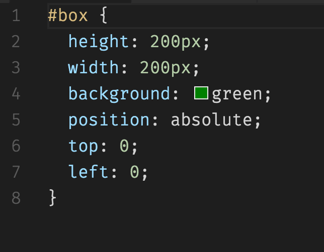
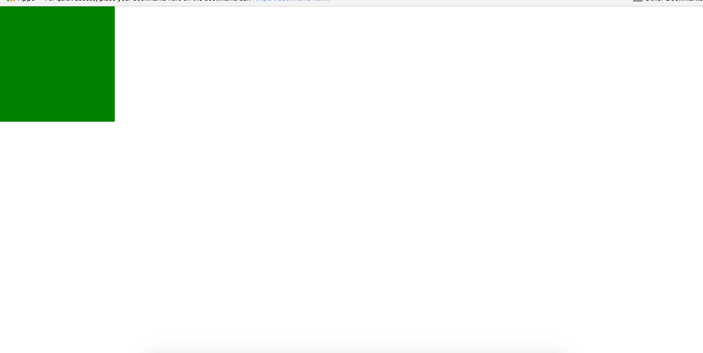

## CSS Positioning!

* Since we'll be drawing with CSS and not creating a web layout, we'll primarily be using relative and absolute positioning.

### Absolute Positioning

* **Q:** What's the difference between absolute and relative positioning?

  * **A:** Absolute positioning takes an element out of the normal flow of the page. We can use the top, left, bottom, right CSS attributes to move this element. This works similarly to a coordinates grid, except slightly different.

    * `top: 0; left: 0;` positions an element at the top left corner of the screen.

      
        (in the browser)
      
    
    * So these properties, (top, left, bottom, right), describe how **far away** the element's corresponding side is from that edge of the screen. 

    * Absolutely positioned elements don't effect the flow of other content on the page. Moving an absolutely positioned element doesn't affect how other neighboring elements are positioned.

    * An absolutely positioned element is positioned within the context of the browser window. So even if the HTML page is taller than the height of the browser window, the absolutely positioned element will be sat at the bottom of the browser window, but will move as the page scrolls.

    * The only time an absolutely positioned element is not positioned relative to the browser window is when it's inside of a non statically positioned container. If that is the case then the absolutely positioned element is positioned relative to that parent container.

### Relative Positioning

* Relatively positioned elements are similar to absolutely positioned ones in that we can use top, bottom, left, and right to position them.

  * Rather than being positioned relative to a parent container or to the browser, a relatively positioned element is positioned relative to where it would have been otherwise. Relative positioned elements still affect their neighbors as they're moved around the page.
  
  * A common use case for relatively positioned elements is to act as a container for absolutely positioned ones.
